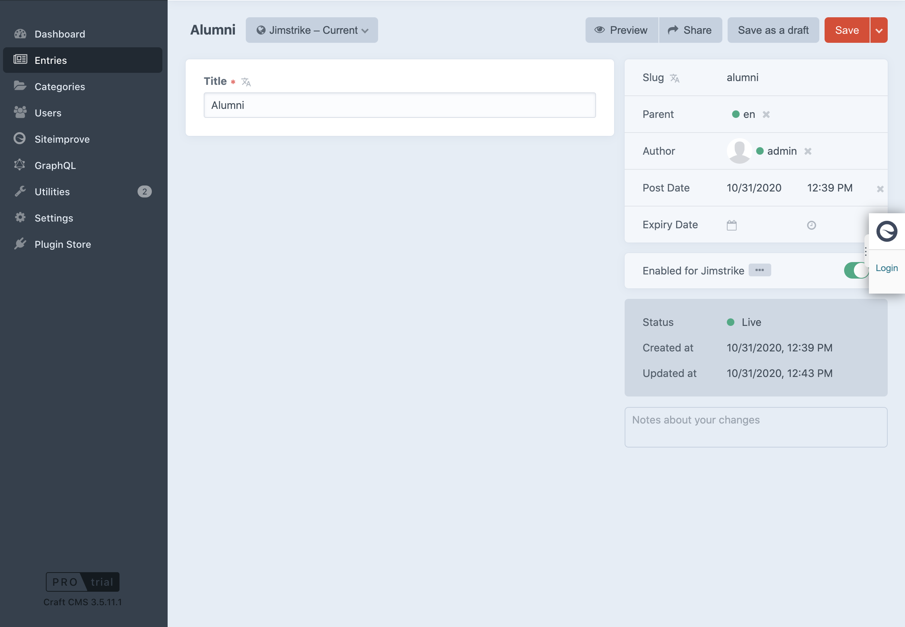
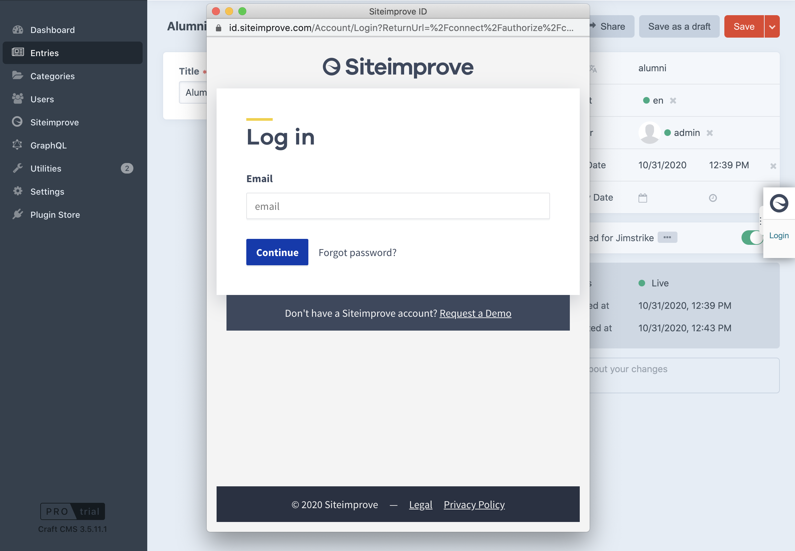
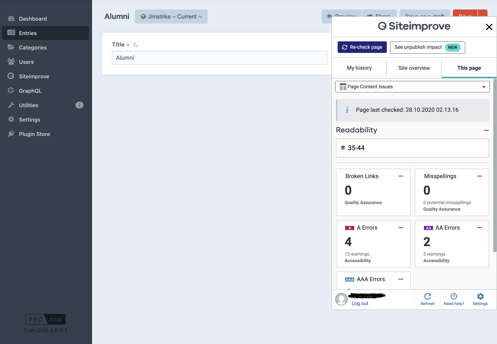

# "Siteimprove CMS Plugin" plugin for Craft CMS 4.x|5.x

Siteimprove data right where you need it.

The Siteimprove plugin bridges the gap between Craft CMS and the Siteimprove Intelligence Platform. 

Thanks to the seamless integration, you are now able to put your Siteimprove results to use where 
they are most valuable - during your content creation and editing process.


## Overview

Siteimprove provides organizations of all shapes and sizes with a solution that makes website management, maintenance,
and optimization both easier and more affordable. Not a customer yet?
Have a look: [www.siteimprove.com](https://www.siteimprove.com/)

The Siteimprove CMS Plugin provides insights into (depending on the Siteimprove services you are subscribed to):
* Misspellings and broken links
* Readability levels
* Accessibility issues (A, AA, AAA conformance level)
* High-priority policies
* SEO: technical, content, UX, and mobile
* Page visits and page views
* Feedback rating and comments

For more information visit: [www.siteimprove.com](https://www.siteimprove.com/)


## Requirements

This plugin requires Craft CMS 4.0.0|5.0.0 or later.

In order to use the Siteimprove CMS plugin, you will need to be a Siteimprove customer. Not a customer yet? Have a look: [www.siteimprove.com](https://www.siteimprove.com/)

## Installation

### From the Plugin Store

Go to the Plugin Store in your project’s Control Panel and search for "Siteimprove CMS Plugin". Then click on the "Install" button.

### With Composer

```bash
# Go to project directory
cd /path/to/my/craft-project

# Tell Composer to load the plugin
composer require jimstrike/siteimprove-cms-plugin

# Tell Craft to install the plugin
./craft plugin/install siteimprove
```

## Using "Siteimprove CMS Plugin" on your site

Go to "Siteimprove CMS Plugin" site settings, follow the instructions and enable it.

## Permissions

By default all admins can use and have the plugin embeded in CP and site pages when it's enabled. For other users admin need to grant permission under - `Users → <User> → Permissions` tab:

>
> **Siteimprove CMS Plugin**  
> ✓ Embed and allow usage
>  

## Troubleshooting tips

If you're having trouble getting the plugin to render properly in Google Chrome after Siteimprove login, try disabling Chrome's "SameSite by default cookies" (`chrome://flags/#same-site-by-default-cookies`).

## Craft 3

To use this plugin with Craft 3 you need to install it from the latest v1.* tag version. [View all tags](https://github.com/jimstrike/siteimprove-cms-plugin/tags).

```bash
# Go to project directory
cd /path/to/my/craft-project

# Tell Composer to load the plugin
composer require jimstrike/siteimprove-cms-plugin:1.0.3

# Tell Craft to install the plugin
./craft plugin/install siteimprove
```

## Screenshots








